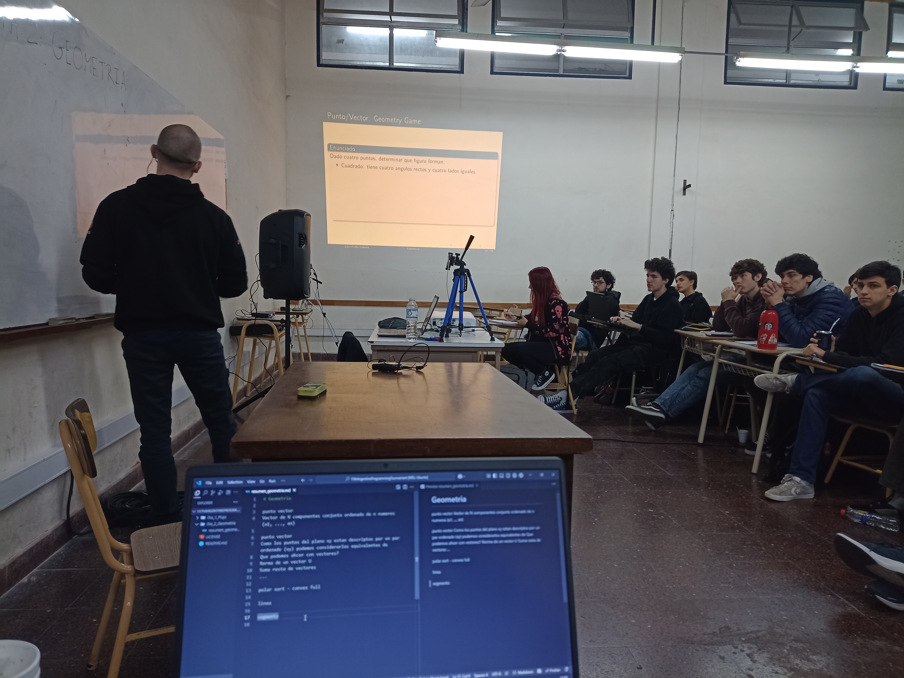
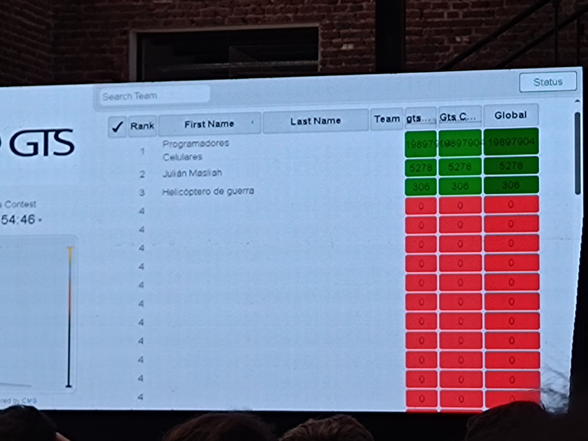
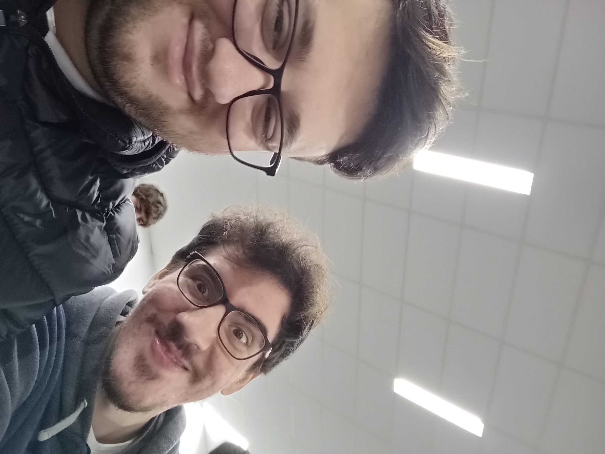
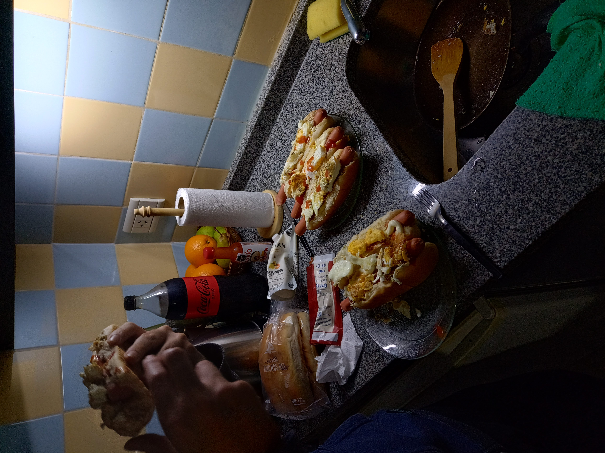
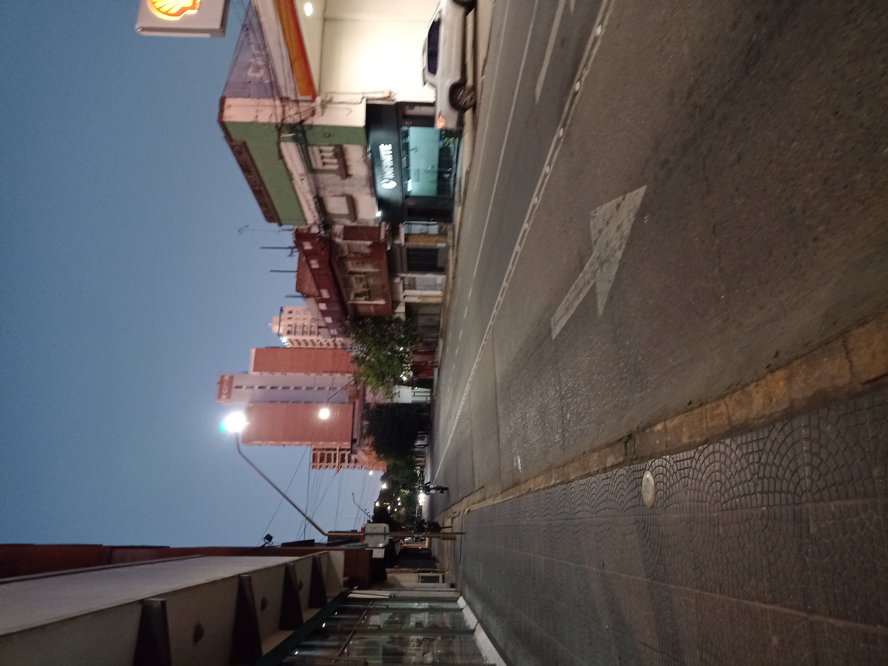

# Training Camp Argentina 2025

Archivos utilizados en el Training Camp Argentina 2025, hosteado este año en la Universidad Tecnológica Nacional (U.T.N.) – Facultad Regional Santa Fe.

## 📘 Español

Fortalecí mis habilidades en programación competitiva mediante estudio intensivo, práctica constante y resolución de problemas complejos. Profundicé en técnicas como programación dinámica y estructuras de datos avanzadas, aplicadas en competencias tipo ICPC. Más allá del aprendizaje técnico, fue una experiencia enriquecedora por el intercambio con otros participantes. Me llevo nuevos conocimientos, amistades y una motivación renovada para seguir entrenando.

## 📗 English

I strengthened my competitive programming skills through intensive study, constant practice, and solving complex problems. I deepened my understanding of techniques such as dynamic programming and advanced data structures, commonly used in ICPC-style competitions. Beyond the technical learning, it was a valuable experience thanks to the exchange with other participants. I leave with new knowledge, meaningful friendships, and a renewed motivation to keep training.

## Participantes de nivel inicial

-   Gino Rubén Giorgi
-   Juan Manuel García

## Fotos

